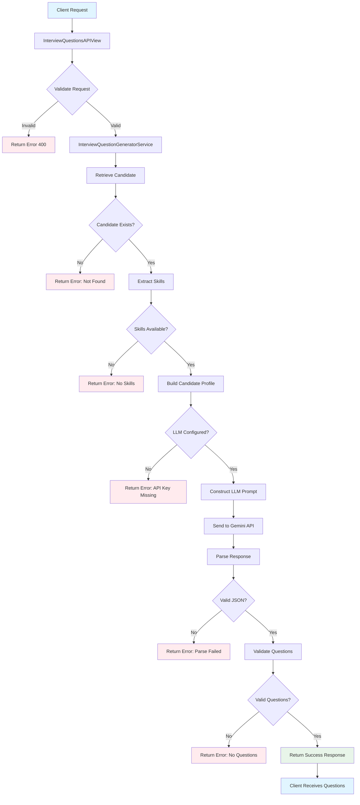

# Interview Questions Generator - Architecture Documentation

## System Overview

The Interview Questions Generator is a microservice within the Resume Intelligence System that leverages AI to create role-specific, skill-targeted interview questions.

## Architecture Diagram



## Component Architecture

### 1. API Layer (`views.py`)

**Component**: `InterviewQuestionsAPIView`

**Responsibilities**:
- HTTP request/response handling
- Input validation
- Error response formatting
- Authentication/authorization (future)

**Flow**:
```
HTTP POST Request
    ↓
Validate candidate_id and job_role
    ↓
Validate question_count (5-10 range)
    ↓
Call service layer
    ↓
Return formatted response
```

### 2. Service Layer (`services/interview_questions.py`)

**Component**: `InterviewQuestionGeneratorService`

**Responsibilities**:
- Business logic implementation
- Database operations
- LLM API integration
- Response validation
- Error handling

**Key Methods**:

#### `generate_interview_questions()`
Main orchestration method that:
1. Retrieves candidate from database
2. Extracts candidate skills
3. Builds candidate profile
4. Constructs LLM prompt
5. Calls LLM API
6. Parses and validates response
7. Returns structured result

#### `_get_candidate_skills()`
Extracts skills from multiple sources:
- Primary: M2M relationship (`skills_m2m`)
- Fallback: JSON field (`skills`)
- Returns: Deduplicated, sorted list

#### `_build_candidate_profile()`
Creates comprehensive profile string:
- Name
- Skills
- Experience
- Education
- Summary

### 3. Data Layer (`models.py`)

**Models Used**:
- `Candidate`: Core candidate data
- `Skill`: Individual skill records
- `Candidate.skills_m2m`: Many-to-many relationship

**Data Flow**:
```
Candidate Model
    ↓
skills_m2m (M2M) → [Skill, Skill, Skill, ...]
    ↓
skills (JSON) → ["Skill1", "Skill2", ...]
    ↓
Combined → Unique, sorted skill list
```

### 4. LLM Integration

**Provider**: Google Gemini API
**Model**: `gemini-2.5-flash-exp`

**Prompt Engineering**:
```python
prompt = f"""
You are an expert technical interviewer. Generate {question_count} interview questions 
for a candidate applying for the {job_role} role.

Candidate Profile:
{candidate_profile}

Key Skills: {skills_str}

Requirements:
1. Generate exactly {question_count} interview questions
2. Questions should be a mix of:
   - Technical questions related to their skills
   - Behavioral questions
   - Role-specific scenarios
   - Problem-solving questions
3. Each question should be clear, specific, and relevant to the {job_role} role
4. Questions should test the candidate's expertise in their listed skills
5. Include at least 2 questions that specifically test their experience with: {skills_str[:200]}

Return ONLY a valid JSON array of question objects. Each object should have:
- "question": The interview question text
- "category": One of ["Technical", "Behavioral", "Scenario-based", "Problem-solving"]
- "skill_related": The primary skill this question tests (or "General" if not skill-specific)
"""
```

## Data Flow

### Request Flow

```
Client
  │ POST /api/candidates/interview-questions/
  │ {candidate_id: 1, job_role: "Python Developer", question_count: 8}
  ↓
Django URL Router
  │ candidates/urls.py
  ↓
InterviewQuestionsAPIView
  │ Validate input
  ↓
InterviewQuestionGeneratorService
  │ generate_interview_questions()
  ↓
Database (PostgreSQL)
  │ Candidate.objects.get(id=1)
  │ candidate.skills_m2m.all()
  ↓
Skill Extraction
  │ _get_candidate_skills()
  ↓
Profile Building
  │ _build_candidate_profile()
  ↓
Gemini API
  │ model.generate_content(prompt)
  ↓
Response Parsing
  │ JSON parsing & validation
  ↓
Return Response
  │ {status: "success", questions: [...]}
  ↓
Client
```

### Response Structure

```json
{
  "status": "success",
  "candidate_id": 1,
  "candidate_name": "John Doe",
  "job_role": "Senior Python Developer",
  "skills": ["Python", "Django", "PostgreSQL"],
  "questions": [
    {
      "question": "Explain how you would optimize a Django REST API for high traffic?",
      "category": "Technical",
      "skill_related": "Django"
    }
  ],
  "question_count": 8
}
```

## Error Handling Strategy

### Validation Layers

1. **API Layer Validation**
   - Required fields check
   - Data type validation
   - Range validation (question_count: 5-10)

2. **Service Layer Validation**
   - Candidate existence check
   - Skills availability check
   - API configuration check

3. **LLM Layer Validation**
   - Response parsing
   - JSON structure validation
   - Question content validation

### Error Responses

```json
// Missing required field
{
  "error": "candidate_id is required"
}

// Candidate not found
{
  "status": "error",
  "error": "Candidate with ID 999 not found"
}

// No skills available
{
  "status": "error",
  "error": "No skills found for this candidate..."
}

// API not configured
{
  "status": "error",
  "error": "Gemini API key not configured..."
}

// LLM parsing error
{
  "status": "error",
  "error": "Failed to parse LLM response..."
}
```

## Performance Considerations

### Response Time

- **Average**: 2-5 seconds per request
- **Factors**: 
  - LLM API response time
  - Network latency
  - Candidate profile size

### Optimization Strategies

1. **Caching**
   - Cache results for (candidate_id, job_role) pairs
   - TTL: 24 hours

2. **Batch Processing**
   - Process multiple candidates in parallel
   - Use async/await for concurrent LLM calls

3. **Database Optimization**
   - Index on candidate skills
   - Prefetch related objects

4. **Rate Limiting**
   - Implement API rate limiting
   - Respect Gemini API quotas

## Security Considerations

### API Key Management

```python
# Secure configuration
GEMINI_API_KEY = os.getenv("GEMINI_API_KEY")

# Never hardcode API keys
# Use environment variables
# Rotate keys regularly
```

### Input Validation

- Sanitize all user inputs
- Validate candidate_id exists
- Limit question_count range
- Escape special characters in job_role

### Rate Limiting

```python
# Future implementation
from rest_framework.throttling import UserRateThrottle

class InterviewQuestionRateThrottle(UserRateThrottle):
    rate = '10/min'  # 10 requests per minute
```

## Testing Strategy

### Unit Tests

**File**: `candidates/tests/test_interview_questions.py`

**Coverage**:
- Service layer methods
- Skill extraction logic
- Profile building
- Response validation
- Error handling

### Integration Tests

**File**: `test_interview_questions_api.py`

**Coverage**:
- API endpoint functionality
- Request/response cycle
- Error scenarios
- Edge cases

### Test Scenarios

1. ✅ Successful question generation
2. ✅ Missing required fields
3. ✅ Invalid candidate_id
4. ✅ Candidate not found
5. ✅ No skills available
6. ✅ API key not configured
7. ✅ Question count validation
8. ✅ LLM response parsing
9. ✅ Multiple skill sources
10. ✅ Various job roles

## Deployment Considerations

### Environment Variables

```env
# Required
GEMINI_API_KEY=your_api_key_here

# Optional
GEMINI_MODEL=gemini-2.0-flash-exp
INTERVIEW_QUESTIONS_CACHE_TTL=86400
INTERVIEW_QUESTIONS_RATE_LIMIT=10/min
```

### Monitoring

**Metrics to Track**:
- Request count
- Response time
- Error rate
- LLM API usage
- Cache hit rate

**Logging**:
```python
logger.info(f"Generated {len(questions)} questions for candidate {candidate_id}")
logger.error(f"Error generating questions: {error}")
```

## Future Enhancements

### Planned Features

1. **Question Difficulty Levels**
   - Easy/Medium/Hard options
   - Adaptive difficulty based on candidate experience

2. **Custom Question Templates**
   - Company-specific questions
   - Role-based question banks

3. **Answer Evaluation**
   - LLM-based answer scoring
   - Automated feedback generation

4. **Question History**
   - Track questions asked to candidates
   - Prevent duplicate questions

5. **Analytics Dashboard**
   - Question effectiveness metrics
   - Candidate performance insights

6. **Multi-language Support**
   - Generate questions in different languages
   - Localization support

### Scalability

**Horizontal Scaling**:
- Stateless service design
- Load balancer ready
- Database connection pooling

**Vertical Scaling**:
- Optimize database queries
- Implement caching
- Use async I/O

## Maintenance

### Regular Tasks

1. **Monitor API Usage**
   - Track Gemini API costs
   - Optimize prompt efficiency

2. **Update Models**
   - Review LLM model updates
   - Test new models

3. **Review Questions**
   - Analyze question quality
   - Refine prompts

4. **Security Updates**
   - Rotate API keys
   - Update dependencies

### Troubleshooting

**Common Issues**:
- API key expired
- Rate limits exceeded
- Invalid LLM responses
- Database connection issues

**Debug Tools**:
- Django Debug Toolbar
- Logging
- Error tracking (Sentry)

## Documentation

**Files**:
- `INTERVIEW_QUESTIONS_API.md` - Full API documentation
- `INTERVIEW_QUESTIONS_QUICK_START.md` - Quick start guide
- `INTERVIEW_QUESTIONS_ARCHITECTURE.md` - This file

**Code Comments**:
- Detailed docstrings for all methods
- Inline comments for complex logic
- Type hints for better IDE support

## Conclusion

The Interview Questions Generator is a well-architected, production-ready service that leverages AI to create meaningful interview questions. The modular design allows for easy maintenance and future enhancements while maintaining high code quality and security standards.