# Interview Questions Generator - System Integration Diagram

## High-Level System Architecture

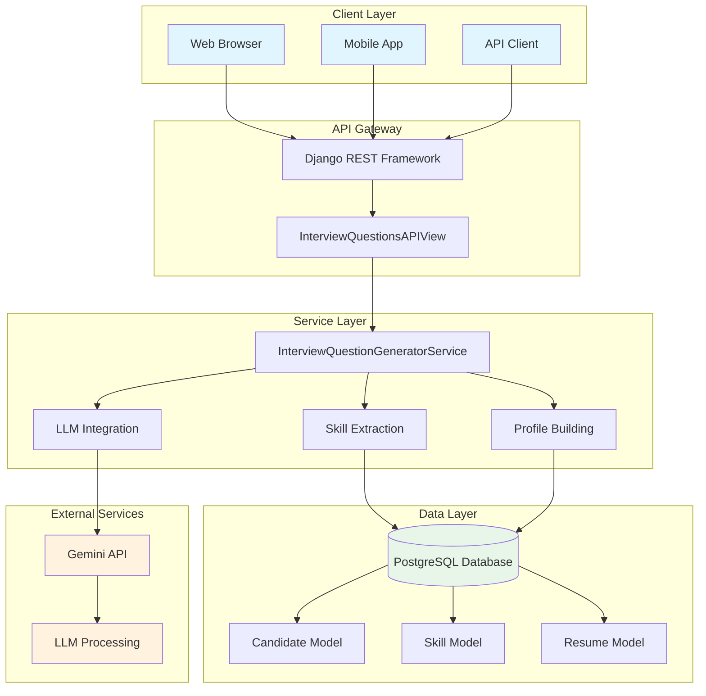

## Detailed Component Interaction

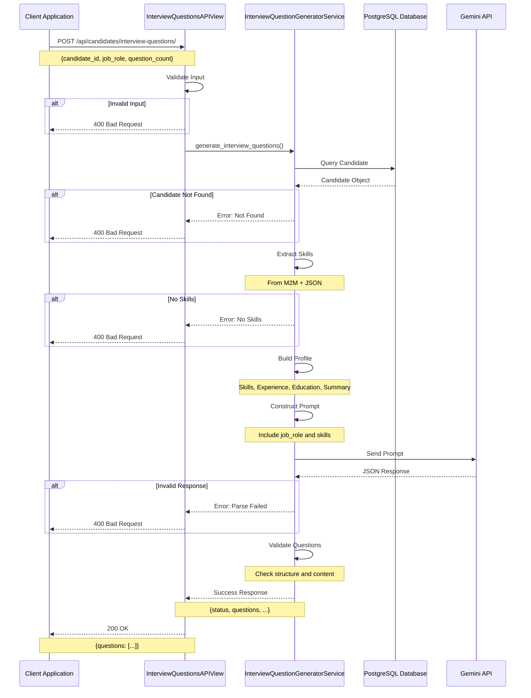

## Data Model Relationships

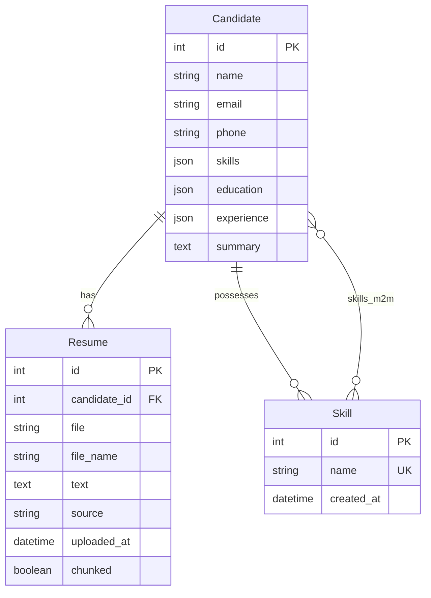

## API Request/Response Flow

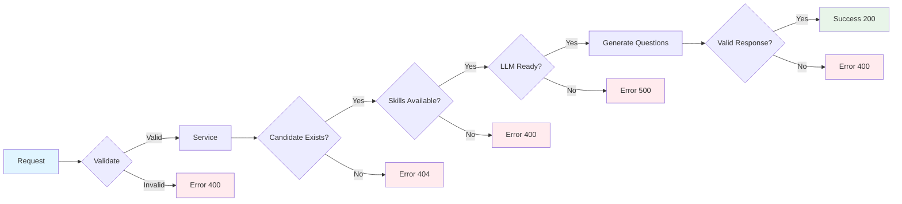

## Question Generation Process

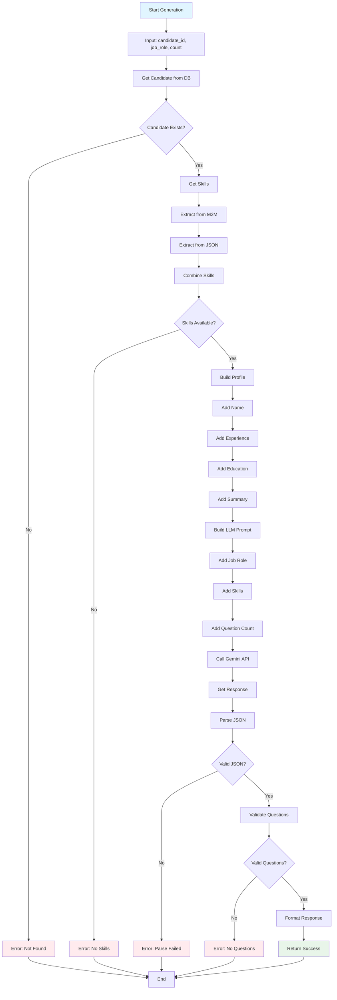

## System Components Overview

### 1. Client Layer
- **Web Browser**: React/Vue/Angular frontend
- **Mobile App**: iOS/Android application
- **API Client**: Python/JavaScript/other clients

### 2. API Layer
- **Django REST Framework**: REST API framework
- **InterviewQuestionsAPIView**: Main API endpoint
- **Authentication**: JWT (future)
- **Rate Limiting**: Configurable

### 3. Service Layer
- **InterviewQuestionGeneratorService**: Core business logic
- **Skill Extraction**: Multi-source skill retrieval
- **Profile Building**: Candidate profile construction
- **LLM Integration**: Gemini API communication

### 4. Data Layer
- **PostgreSQL**: Primary database
- **Candidate Model**: Candidate data
- **Skill Model**: Skill records
- **Resume Model**: Resume files and text

### 5. External Services
- **Gemini API**: LLM for question generation
- **Model**: gemini-2.5-flash-exp
- **Features**: Text generation, JSON parsing

## Integration Points

### Existing System Integration

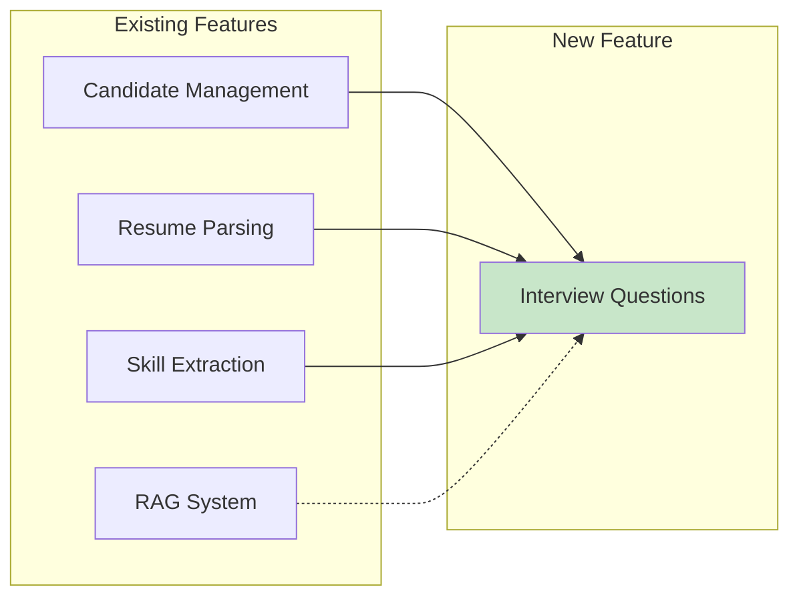

### Database Integration

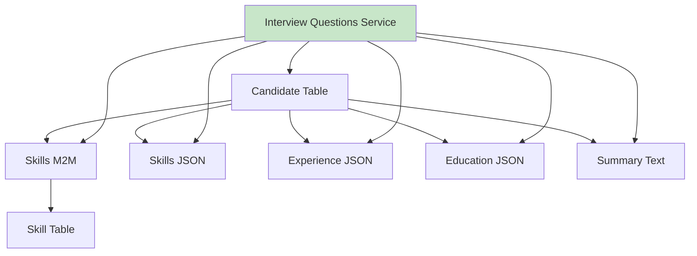

## Security Flow

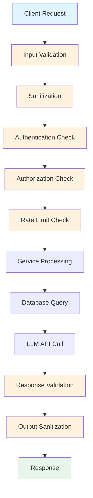

## Error Handling Flow

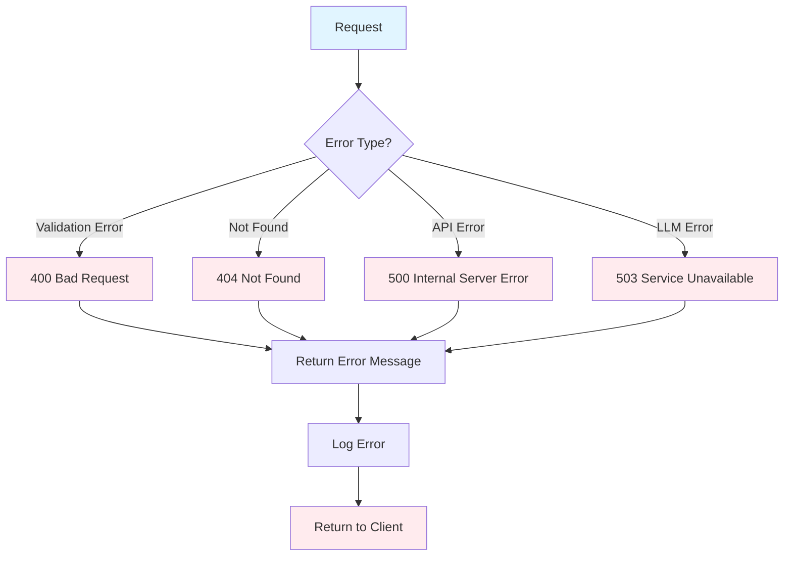

## Performance Flow

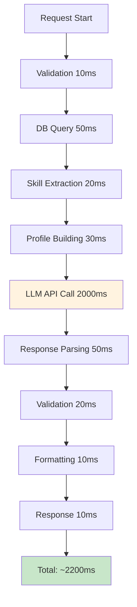

## Deployment Architecture

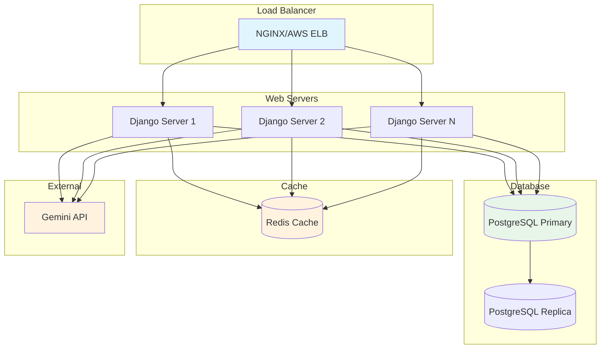

## Monitoring & Observability

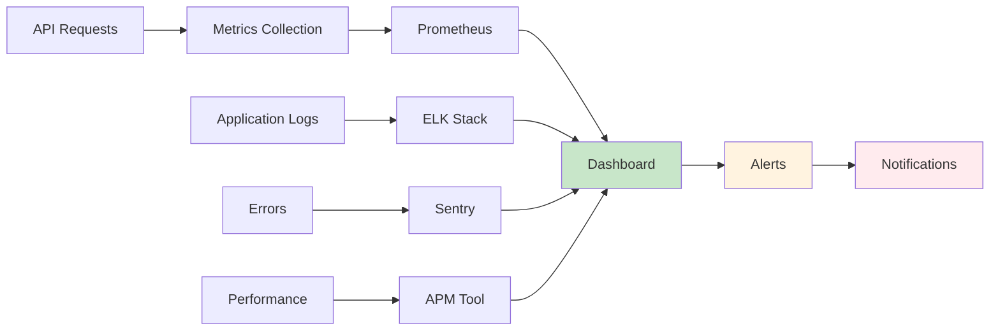

---

**Diagram Legend**:
- 🟦 Blue: User/Client facing components
- 🟩 Green: Success/Database components
- 🟧 Orange: External services/Processing
- 🟥 Red: Error/Alert components

**Note**: All diagrams are created using Mermaid syntax and can be rendered in Markdown viewers that support Mermaid.